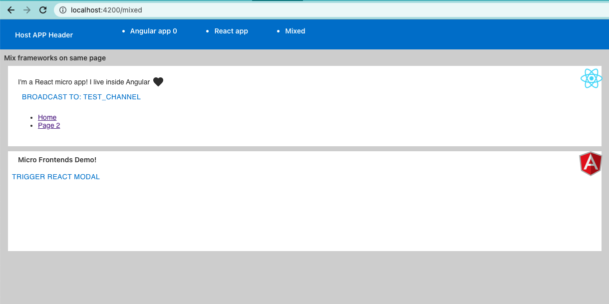

# ng-mfe-npmws-nx

Playground repo for getting a better grasp of combining:


- npm workspaces (pkg mgmt)
- nx (build/dev tooling)
- wp5 module federation, enable cross micro frontends, Angular + React

And see if combining the 3 could fit my current needs.

Goals:
1. Have feature apps with own package json for version mgmt control when publishing 
to npm / artifactory. will check out "generatePackageJson": true
2. Development: using nx - have a command which starts the shell and a specific ft app.
3. Build: using nx configure building the shared vendors - e.g. the framework.


Getting Started npm workspaces: 

- Adding new package/project to the workspace packages:
``npm init -w ./packages/app-x``

- Running np script for single package example: 
``npm run test --w=packages/app-x``

- Running np script for all packages example: 
``npm run test --ws``


Getting started with NX as build tool:
- Start all apps example: ```nx run-many --target=start --all```
- Start specific app example: ``` nx run host-app:start```

CookBook:

### Starting a monorepo with npm workspaces:

- Init an npm workspace projects (see readme for instructions)
- Inside packages I generated 2 angular apps using the angular cli (removed the generated node_modules of each app)
- Run: ``npm i ws`` To install all dependencies
- Run: ``npm start --w=packages/feature-app`` just for testing ability to start one app seperatly
- NOTE - can't start both apps using ``npm start ws``, Let's integrate NX

### Integrating the NX building tool
- Followed the [Adding Nx to Lerna/Yarn/PNPM Workspace
  ](https://nx.dev/l/a/migration/adding-to-monorepo) guide
- Run ``npx add-nx-to-monorepo``
- Had to upgrade the typescript version

### Combine module federation (Angular host app):
- install ```@angular-architects/module-federation ```
- Generate the shell app ``npx nx g @nrwl/angular:app shell --mfe --mfeType=host --routing=true``
- Generate the feature app `` nx g @nrwl/angular:app ft1_app --mfe --mfeType=remote --port=4201 --host=shell --routing=true
  ``
- Include package.json file with each app version and dependencies for future publishing
- Tweak the ts configs
- Serve both: ``nx run shell:serve-mfe``

Configuration tweaks:
- prefer project.json in every project rather huge workspace.json
- In order to have the package.json copied to dist I created a script on each project e.g. --> 
``"cp:pkjson": "cp package.json ../../dist/packages/shell/"``
and an npm script on the root package.json which applies the copy to all the projects 
``nx run-many --target=build --all && npm run --ws cp:pkjson``
- Prefer the use of webpack's externals to exclude packing the frameworks of micro-apps
- React app ** overwriting the webpack configuration 

Issues to follow:

apps reload loop: 
- https://github.com/nrwl/nx/issues/7862 -watch this issue!!! (follow this PR: https://github.com/nrwl/nx/pull/8020)
- https://github.com/angular-architects/module-federation-plugin/issues/96 
- https://github.com/webpack/webpack/pull/14827


- manually added "baseUrl": "packages" in base ts config
- https://github.com/nrwl/nx/issues/1777
- there's no schematic for adding react as micro app with module federation 


Dev container image:

``docker build -t frontends-container:latest -f Dockerfile .``

Run: 
```docker run -d -p 8080:80 frontends-container:latest```
